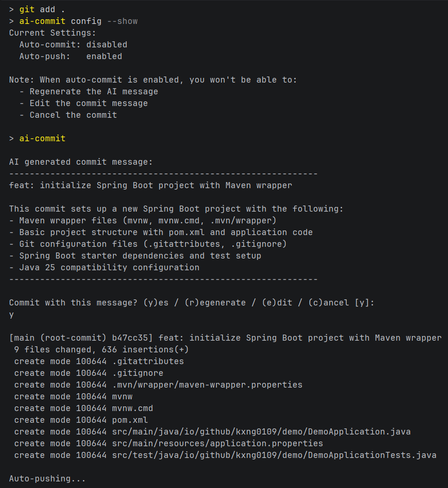

# AI Commit CLI



> Generate conventional commit messages using AI. It supports OpenAI, Anthropic Claude, Google Gemini, DeepSeek, Ollama, and any OpenAI-compatible API.

[](https://github.com/kxng0109/ai-commit-cli/releases)
[](https://github.com/kxng0109/ai-commit-cli/actions/workflows/release.yml)
[](https://github.com/kxng0109/ai-commit-cli/actions/workflows/ci.yml)
[](LICENSE)

## Why This Exists

I was tired of writing vague commit messages like "fix stuff" and "updates", even using sentences like "added ..." or "made ...". I wanted AI to analyze my git diffs and generate proper commit messages, so I started searching for solutions.

**What I found:**
- Tools that didn't work or were too complicated to set up
- Solutions that didn't integrate well with IntelliJ IDEA (my main IDE)
- The JetBrains AI Assistant plugin, which was almost perfect

**The JetBrains AI Assistant Problem:**

The plugin works great and integrates seamlessly with IntelliJ. It can generate commit messages using local models (Ollama, LM Studio) or cloud models, and even do wayyy more things. The free tier is generous, and it gives you access to tons of models. Basically Google's full lineup, Anthropic's Claude, OpenAI (even GPT-5.1).

But here's where I hit a wall:
- **No custom API endpoints** - I couldn't use OpenRouter to access multiple providers with one key
- **No DeepSeek** - What if I wanted to use their cost-effective API directly?
- **IDE-locked** - Only works in JetBrains IDEs (requires IntelliJ IDEA Ultimate license)
- **Not portable** - What if I switch to VSCode, Sublime Text, or just use the terminal?

**I wanted freedom:**
- Use models from *anywhere* - OpenRouter, DeepSeek, local Ollama, custom endpoints
- Work with *any* editor/IDE
- Run from the terminal on *any* platform
- Own my workflow completely

So I built this. A standalone CLI that works everywhere, supports any OpenAI-compatible API, you determine the cost (you can use free or paid providers, the choice is yours), and never locks you into a specific IDE or subscription.

## Features

- **True Multi-Provider Support** - OpenAI, Anthropic, Google Gemini, DeepSeek, Ollama, or any OpenAI-compatible API (OpenRouter, Together AI, etc.)
- **Use Any API** - Not limited to specific providers. Bring your own endpoint
- **Conventional Commits** - Follows [specification](https://www.conventionalcommits.org/) automatically
- **Interactive Mode** - Review, regenerate, edit, or cancel before committing
- **Auto-Commit & Auto-Push** - Flexible automation options (work independently for maximum flexibility)
- **Native Binary** - No runtime dependencies, starts in <50ms
- **Cross-Platform** - Linux, macOS, Windows
- **Privacy Option** - Use Ollama for 100% local processing (but be sure that you're using a model that your system can handle)
- **IDE-Agnostic** - Works from any terminal, any editor
- **Cost Control** - Use free providers or choose your own pricing tier

## Installation

### Option 1: One-Line Installer (Easiest)

Installers verify the release SHA256 checksum before installing. Pin a version with `AI_COMMIT_VERSION=vX.Y.Z`, or verify without installing via `--verify-only`. Every release also ships a CycloneDX SBOM (`ai-commit-<platform>.bom.json`) and keyless SLSA build-provenance attestations (check with `gh attestation verify <file> -R kxng0109/ai-commit-cli`).

**Linux/macOS:**
```bash
curl -fsSL https://raw.githubusercontent.com/kxng0109/ai-commit-cli/main/install.sh | bash
```

**Windows (PowerShell as Administrator not required):**
```powershell
irm https://raw.githubusercontent.com/kxng0109/ai-commit-cli/main/install.ps1 | iex
```

### Option 2: Download Binary Manually

Download the pre-built binary for your platform from [Releases](https://github.com/kxng0109/ai-commit-cli/releases/latest).

**Linux:**
```bash
curl -L https://github.com/kxng0109/ai-commit-cli/releases/latest/download/ai-commit-linux-amd64 -o ai-commit
curl -L https://github.com/kxng0109/ai-commit-cli/releases/latest/download/ai-commit-linux-amd64.sha256 -o ai-commit-linux-amd64.sha256
sha256sum -c ai-commit-linux-amd64.sha256
chmod +x ai-commit
sudo mv ai-commit /usr/local/bin/
ai-commit --version
```

**macOS:**
```bash
curl -L https://github.com/kxng0109/ai-commit-cli/releases/latest/download/ai-commit-macos-amd64 -o ai-commit
chmod +x ai-commit
sudo mv ai-commit /usr/local/bin/
ai-commit --version
```

**Windows (PowerShell):**
```powershell
Invoke-WebRequest -Uri "https://github.com/kxng0109/ai-commit-cli/releases/latest/download/ai-commit-windows-amd64.exe" -OutFile "ai-commit.exe"
# Move to a directory in your PATH, e.g., C:\
Move-Item ai-commit.exe C:\
ai-commit --version
```

### Build from Source

**Requirements:**
- GraalVM 25 (with native-image)
- Apache Maven 3.9.16
- Java 25

**Steps:**
```bash
git clone https://github.com/kxng0109/ai-commit-cli.git
cd ai-commit-cli

mvn clean verify

# Binary location: target/ai-commit (or ai-commit.exe on Windows)
sudo cp target/ai-commit /usr/local/bin/  # Linux/macOS
# or add to PATH on Windows

ai-commit --version
```

**Development build (JAR, faster):**
```bash
mvn clean package
java -jar target/ai-commit-cli-1.3.0.jar --version
```

## Quick Start

**1. Configure AI Provider** (choose one):

```bash
# OpenAI
export OPENAI_API_KEY="sk-..."

# Anthropic Claude
export ANTHROPIC_API_KEY="sk-ant-..."

# Google Gemini
export GOOGLE_API_KEY="AIza..."

# DeepSeek
export DEEPSEEK_API_KEY="..."

# Ollama (local)
export OLLAMA_MODEL="llama3.2"
```

**2. Use:**

```bash
cd your-git-repo
git add .
ai-commit
```

## Configuration

### AI Providers

| Provider | Required | Optional |
|----------|----------|----------|
| **OpenAI** | `OPENAI_API_KEY` | `OPENAI_MODEL` (default: gpt-4o-mini)<br>`OPENAI_BASE_URL` (default: https://api.openai.com) |
| **Anthropic** | `ANTHROPIC_API_KEY` | `ANTHROPIC_MODEL` (default: claude-sonnet-4-0) |
| **Google** | `GOOGLE_API_KEY` | `GOOGLE_MODEL` (default: gemini-2.0-flash) |
| **DeepSeek** | `DEEPSEEK_API_KEY` | - |
| **Ollama** | `OLLAMA_MODEL` | `OLLAMA_BASE_URL` (default: http://localhost:11434) |

**Priority:** OpenAI → Anthropic → Google → DeepSeek → Ollama

### Optional Settings

| Variable | Default | Range |
|----------|---------|-------|
| `AI_TEMPERATURE` | 0.1 | 0.0 - 2.0 |
| `AI_COMMAND_TIMEOUT` | 30 | 1 - 3600 seconds (`AI_TIMEOUT` still works as a deprecated alias) |
| `AI_ALLOW_INSECURE_HTTP` | false | Set `true` only to allow plain-http AI endpoints for non-local hosts |
| `AI_LOG_LEVEL` | WARN | ERROR, WARN, INFO, DEBUG |

### User Preferences (Persistent)

Configure workflow automation that persists across restarts:

```bash
# View current settings
ai-commit config --show

# Enable auto-commit (skip interactive prompts)
ai-commit config --auto-commit on

# Enable auto-push (push after committing)
ai-commit config --auto-push on

# Disable automation
ai-commit config --auto-commit off
ai-commit config --auto-push off

# Reset all settings
ai-commit config --reset

# Show config help
ai-commit config --help
```

## Usage Modes

### Interactive Mode (Default)

Review and control every commit:

```bash
git add .
ai-commit
```

**Output:**
```
AI generated commit message:
────────────────────────────────────────────────────────────
feat(auth): add OAuth2 authentication flow

Implement Google OAuth2 integration with JWT token handling
and secure session management.
────────────────────────────────────────────────────────────

Commit with this message? (y)es / (r)egenerate / (e)dit / (c)ancel [c]:
```

Fail-closed by design: empty input, end-of-stream, or a read error cancels
the commit. Only an explicit `y`/`yes` commits.

**Options:**
- **`y`/`yes`** - Commit with the AI-generated message (explicit confirmation required)
- **`r` (regenerate)** - Generate a new message with different wording
- **`e` (edit)** - Manually edit the message before committing (`c` at the edit prompt cancels)
- **`c` (cancel)** - Cancel and don't commit (default, just press Enter)

### Auto-Commit Mode

Skip prompts and commit immediately:

```bash
# One-time setup
ai-commit config --auto-commit on

# Fast workflow
git add .
ai-commit  # Commits automatically, no prompts
```

**⚠️ Warning:** When auto-commit is enabled:
- You cannot regenerate the message
- You cannot edit the message
- You cannot cancel the commit
- If AI generation fails, nothing is committed

### Auto-Push Mode

Automatically push after committing:

```bash
# One-time setup
ai-commit config --auto-push on

# Super fast workflow
git add feature.js
ai-commit  # If auto-commit is enabled, it commits instantly AND pushes instantly!
# Note: auto-push does not require auto-commit to work
```

### Command-Line Flags

Flags work on any run without changing saved settings:

```bash
git add .
ai-commit --yes                    # Commit immediately, no prompt (great for scripts)
ai-commit --dry-run                # Print the message, commit nothing
ai-commit --amend                  # Regenerate the message and amend the last commit
ai-commit -a                       # Stage tracked modifications first (like git commit -a)
ai-commit --provider anthropic     # Use one provider for this run only
ai-commit --model gpt-4o           # Override the model for this run only
ai-commit --provider ollama --model llama3
```

Unknown options and commands are rejected instead of ignored. `--model` is
rejected for DeepSeek, which uses a fixed model.

### Shell Completions

```bash
# Bash
ai-commit completion bash >> ~/.bash_completion
# Zsh
ai-commit completion zsh > ~/.zsh/completions/_ai-commit
# Fish
ai-commit completion fish > ~/.config/fish/completions/ai-commit.fish
# PowerShell
ai-commit completion powershell >> $PROFILE
```

## Examples

**OpenAI:**
```bash
export OPENAI_API_KEY="sk-..."
git add .
ai-commit
```

**OpenRouter (multiple providers):**
```bash
export OPENAI_API_KEY="sk-or-..."
export OPENAI_BASE_URL="https://openrouter.ai/api/v1"
export OPENAI_MODEL="openai/gpt-oss-20b:free"
git add .
ai-commit
```

**Ollama (100% local):**
```bash
ollama serve &
export OLLAMA_MODEL="llama3.2"
git add .
ai-commit
```

**Rapid Development Workflow:**
```bash
# One-time setup
ai-commit config --auto-commit on
ai-commit config --auto-push on

# Daily usage
git add src/
ai-commit  # Committed and pushed
git add tests/
ai-commit  # Committed and pushed
```

**Careful Review Workflow:**
```bash
# Ensure interactive mode
ai-commit config --auto-commit off

# Review each commit
git add feature.js
ai-commit
```

## How It Works

1. **Stage your changes:** `git add .`
2. **Run ai-commit:** Analyzes the git diff
3. **AI generates message:** Sends to your configured provider (OpenAI, OpenRouter, Ollama, etc.)
4. **Alerts user:** Shows the commit message with some options for the user to decide if they are satisfied with the generated commit message. 

```
Staged diff → AI analysis → Commit message → [Interactive/Auto] → Git commit → [Optional push]
```

## Real-World Comparison

**JetBrains AI Assistant (what I was using):**
```
✅ Great IDE integration
✅ Generous free tier
✅ Many models (Google, Anthropic, OpenAI)
❌ Can't use OpenRouter/DeepSeek/custom APIs
❌ Requires IntelliJ IDEA Ultimate
❌ IDE-locked (no terminal/other editors)
```

**AI Commit CLI (what I built):**
```
✅ Use ANY provider (OpenRouter, DeepSeek, custom endpoints)
✅ Works anywhere (any IDE, terminal, SSH sessions)
✅ Auto-commit & auto-push for rapid workflows
✅ Free and open source
✅ Full control over API costs
✅ 100% local option with Ollama
✅ ~99MB binary, no dependencies
```

## Example Output

**Before:**
```bash
git commit -m "updated auth stuff"
```

**After (Interactive Mode):**
```bash
$ ai-commit

AI generated commit message:
────────────────────────────────────────────────────────────
feat(auth): add OAuth2 authentication flow

Implement Google OAuth2 integration with JWT token handling,
refresh token rotation, and secure session management.

BREAKING CHANGE: API now requires OAuth2 tokens
────────────────────────────────────────────────────────────

Commit with this message? (y)es / (r)egenerate / (e)dit / (c)ancel [y]: y

[main abc1234] feat(auth): add OAuth2 authentication flow
 3 files changed, 145 insertions(+), 12 deletions(-)
```

**After (Auto-Commit Mode):**
```bash
$ ai-commit

AI generated commit message:
────────────────────────────────────────────────────────────
feat(auth): add OAuth2 authentication flow

Implement Google OAuth2 integration with JWT token handling,
refresh token rotation, and secure session management.
────────────────────────────────────────────────────────────

Auto-committing...

[main abc1234] feat(auth): add OAuth2 authentication flow
 3 files changed, 145 insertions(+), 12 deletions(-)

Auto-pushing...

To github.com:user/repo.git
   def5678..abc1234  main -> main
```

## Advanced Configuration

### Using OpenRouter (Multiple Models via One API)

Access Claude, GPT-4, Llama, and more through [OpenRouter](https://openrouter.ai):

```bash
export OPENAI_API_KEY="sk-or-v1-..."
export OPENAI_BASE_URL="https://openrouter.ai/api/v1"
export OPENAI_MODEL="qwen/qwen3-coder"
# or: "openai/gpt-4o", etc.
git add .
ai-commit
```

### Temperature Control

Higher = more creative, lower = more deterministic:

```bash
export AI_TEMPERATURE="0.0"  # Very consistent
export AI_TEMPERATURE="0.5"  # Balanced (recommended for variety)
export AI_TEMPERATURE="1.5"  # More creative descriptions
```

### Debugging

```bash
export AI_LOG_LEVEL="DEBUG"
ai-commit
```

### Long-running Git Operations

```bash
export AI_COMMAND_TIMEOUT="120"  # 2 minutes (default: 30)
```

### Workflow Customization

```bash
# Maximum speed. Auto-commit + auto-push
ai-commit config --auto-commit on
ai-commit config --auto-push on

# Fast commits, manual pushes. Review before pushing
ai-commit config --auto-commit on
ai-commit config --auto-push off

# Full control. Review every message
ai-commit config --auto-commit off
```

## Technical Details

**Built With:**
- Java 25
- Apache Maven 3.9.11
- GraalVM 25 (native-image)
- Spring AI 1.1.0

**Binary Size:** ~99MB (includes all 5 AI providers)

**Startup Time:** <50ms (native binary)

**Supported Platforms:**
- Linux x86_64 (glibc 2.17+)
- macOS x86_64 (10.13+)
- Windows x86_64 (10+)

## Troubleshooting

**"No staged changes found"**
```bash
git status  # Verify you're in a git repo
git add .   # Stage your changes first
```

**"Cannot connect to AI provider"**
```bash
# Verify API key is set
echo $OPENAI_API_KEY

# Test with debug logging
export AI_LOG_LEVEL=DEBUG
ai-commit
```

**"Command not found"**
- Ensure binary is in PATH
- Restart terminal after installation

**"Auto-push failed but commit succeeded"**
- This is expected behavior but commit is preserved
- Push manually: `git push`
- Check remote configuration: `git remote -v`

**"Auto-commit not working"**
```bash
# Check if enabled
ai-commit config --show

# Enable it
ai-commit config --auto-commit on
```

## Development

```bash
# Build JAR (fast iteration)
mvn clean package
java -jar target/ai-commit-cli-1.3.0.jar

# Build native binary (GraalVM required; JaCoCo gate enforced via verify)
mvn clean verify

# Run with debug logging
export AI_LOG_LEVEL=DEBUG
./target/ai-commit

# Run tests with the 90% line+branch coverage gate
mvn verify -DskipNativeBuild=true
```

## FAQ

**Q: Why not just use JetBrains AI Assistant?**  
A: It's excellent for IntelliJ users, but it limits you to their provider selection (no OpenRouter, DeepSeek, or custom APIs), requires IntelliJ IDEA Ultimate, and only works inside JetBrains IDEs. This tool works everywhere and with any provider.

**Q: Which AI provider should I use?**  
A: Honestly, it's your choice. For instance, I use OpenRouter mainly since you can get really good models for free and have access to a lot of models with just one API key. Then I use ollama (or LM Studio) just for testing. You can get professional grade models, but you're limited by your system's hardware.

**Q: Does this send my code to AI providers?**  
A: It sends the git diff (changes only), not your entire codebase. Before sending, the diff is scanned locally: secrets (API keys, private keys, tokens, credentialed URLs), binary content, generated lockfiles, and diffs over 64KB are refused and never leave your machine. Provider base URLs must be https except for loopback hosts. Use Ollama for fully local processing with zero external API calls.

**Q: How much memory does it use?**  
A: The native binary caps its heap at 256MB (worst-case RSS stays well under 1GB, versus 80% of RAM uncapped). Override per run with `./ai-commit -Xmx1g` if you ever need more.

**Q: When should I use auto-commit vs interactive mode?**  
A: Use **auto-commit** for rapid development when you trust the AI (small, frequent commits). Use **interactive mode** when you want to review messages carefully (large changes, important commits).

**Q: What happens if AI generation fails with auto-commit enabled?**  
A: Nothing is committed. Auto-commit only proceeds if the AI successfully generates a valid message. Your changes remain staged.

**Q: Can I edit the message with auto-commit enabled?**  
A: No. Auto-commit skips all prompts. Disable it first: `ai-commit config --auto-commit off`

**Q: Does auto-push require auto-commit?**  
A: No. Auto-push can work without auto-commit being enabled. But if you need a fully automated workflow, you can enable it, just note that you won't be able to modify the commit message.

**Q: How much does it cost?**  
A: Depends on your provider:
- OpenAI gpt-4o-mini: ~$0.0001-0.001 per commit
- DeepSeek: ~$0.00001 per commit
- Ollama: $0 (free, local)
- OpenRouter: Varies by model (many free options)

**Q: Why is the binary 99MB?**  
A: It includes 5 AI provider SDKs and the GraalVM runtime for instant startup. Future versions may offer slim builds with only the providers you need.

**Q: Does it work with monorepos?**  
A: Yes, it analyzes all staged changes regardless of repo structure.

**Q: Can I use this in CI/CD?**  
A: Yes! Set environment variables and enable auto-commit for fully automated commit message generation in pipelines.

**Q: Can I export my settings?**  
A: Not directly, but they're stored in standard OS locations. You can back up those files manually.

## Contributing

Contributions welcome! See [CONTRIBUTING.md](CONTRIBUTING.md) for guidelines.

## License

[MIT](LICENSE) - use freely, commercially or personally.

## Acknowledgments

- Built with [Spring AI](https://spring.io/projects/spring-ai)
- Compiled with [GraalVM](https://www.graalvm.org/)
- Inspired by [Conventional Commits](https://www.conventionalcommits.org/)

## Support

- [Documentation](https://github.com/kxng0109/ai-commit-cli)
- [Report Issues](https://github.com/kxng0109/ai-commit-cli/issues)
- [Request Features](https://github.com/kxng0109/ai-commit-cli/issues/new?labels=enhancement)

## Related Projects

- [JetBrains AI Assistant](https://www.jetbrains.com/ai/) - IDE-integrated AI (IntelliJ IDEA Ultimate)
- [OpenRouter](https://openrouter.ai/) - Unified API for 200+ AI models
- [Ollama](https://ollama.ai/) - Run AI models locally

---

**Built because I wanted to use OpenRouter and DeepSeek from anywhere, not just IntelliJ. Now with auto-commit and auto-push for lightning-fast workflows. If it helps you too, give it a star 🤗**